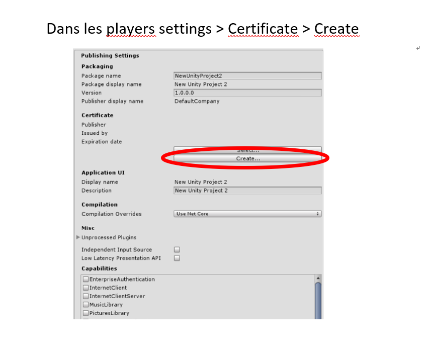

# HoloLens_3D_Reconstitution
Reconstitution 3D d'objet à partir de l'HoloLens

## HoloLensCameraStream

Récupération du flux, de la position et orientation de la caméra RGB.

## Installation 

Suivre les étapes de : https://github.com/VulcanTechnologies/HoloLensCameraStream

A faire également : 

## Versions

### V0

- Projecte en temps réel l'image de la caméra sur l'environnement. L'image se superpose bien avec l'environnement.
- A chaque clic, l'image est enregistré dans un fichier .obj (la direction des pixels est correcte, il manque leur profondeur pour construire l'objet 3D de l'image). 
- Une fois l'image enregistrée, un rayon est créé afin de repérer les endroits où l'on a déjà capturé des images.

### V1

- Ajout d'un objet raycast pour déterminer le point d'intersection entre le spatial mapping (obtenu via ce tuto : https://docs.microsoft.com/en-us/windows/mixed-reality/holograms-230) et la droite formé par l'origine de la caméra et la direction du regard.
- Ajout d'un mesh text pour obtenir les coordonnées de ce point
- Résultat étrange car le point semble très proche

### V2

- Avec le raycast obtention de la distance de la profondeur
- Le raycast est maintenant sensible uniquement au spatial mapping et plus aux élèments parasites (caméra, mesh en tout genre)
- Résultat cohérent
